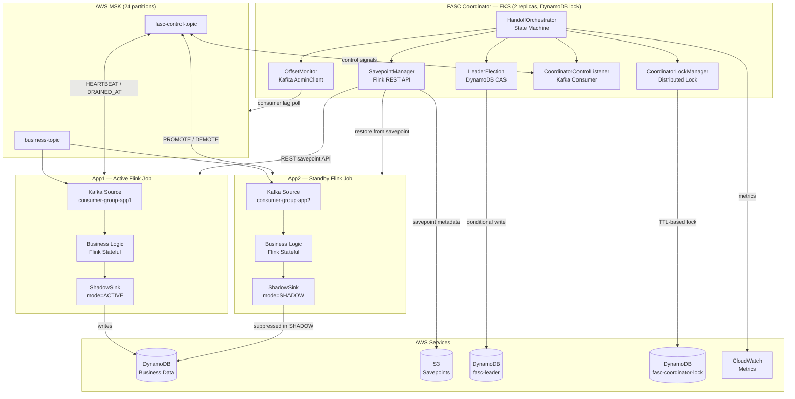
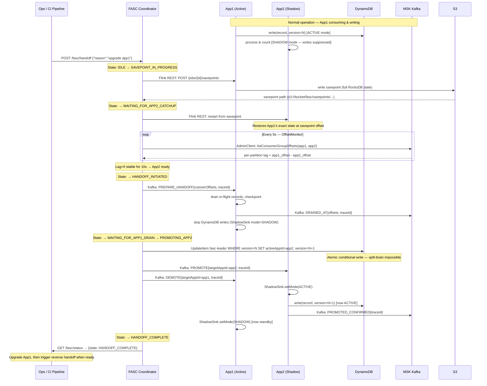

# flink-fasc — Flink Active-Standby Coordinator

> **Zero-downtime, zero-message-loss upgrade protocol for Apache Flink applications.**

[](LICENSE)
[](https://openjdk.java.net/)
[](https://flink.apache.org/)
[](https://spring.io/projects/spring-boot)

---

## The Problem

Upgrading a stateful Flink application without data loss is hard. The standard
blue-green approach fails when state cannot be rebuilt from Kafka alone:

```
App1 (Active)  — 6 months of accumulated business state (stateX)
App2 (Standby) — starts fresh (stateSB)

Result: stateX ≠ stateSB → wrong DynamoDB writes during switchover
```

Kafka topic retention (7 days default) cannot rebuild months of state. There is no
native Flink mechanism for warm-standby with automatic handoff.

---

## The Solution: FASC Protocol

FASC uses a three-phase protocol that guarantees App2 reaches exactly the same state as
App1 before any handoff occurs:

```
Phase 1 — Bootstrap:     Save App1 state (Flink savepoint) → start App2 from that savepoint
Phase 2 — Warm Standby:  App2 processes same Kafka messages in SHADOW mode (writes suppressed)
Phase 3 — Handoff:       Offset-aware atomic switchover via DynamoDB conditional write (~500ms)
```

**Mathematical correctness guarantee:**

```
App2 state after savepoint bootstrap  = App1 state at offset X    [Flink savepoint]
App2 processes same messages X → C   = same Kafka, same order     [Kafka guarantee]
Deterministic business logic          = event time only            [design contract]
─────────────────────────────────────────────────────────────────────────────────────
App2 state at offset C  ≡  App1 state at offset C                 [proven equivalent]
```

---

## Architecture



---

## End-to-End Data Flow



---

## Quick Start — 5 Lines of Code

The only change to your Flink job is wrapping your sink:

```java
// Before FASC — your existing Flink job
stream.addSink(new DynamoDbSink(config));

// After FASC — wrap your sink, nothing else changes
FASCConfiguration fascConfig = FASCConfiguration.fromEnv();
stream.addSink(ShadowSink.wrap(new DynamoDbSink(config), fascConfig));
```

Set environment variables per-job:

```bash
FASC_BOOTSTRAP_SERVERS=broker1:9094,broker2:9094
FASC_APP_ID=app1                   # or app2
FASC_CONTROL_TOPIC=fasc-control-topic
FASC_INITIAL_MODE=ACTIVE           # ACTIVE for app1, SHADOW for app2
```

---

## Modules

| Module | Description |
|---|---|
| `fasc-core` | Pure Flink library. `ShadowSink`, `FASCConfiguration`, control protocol. Zero AWS dependency. Add as a Flink job dependency. |
| `fasc-coordinator` | Spring Boot service. Savepoint lifecycle, offset monitoring, handoff state machine, REST API. Deploy on EKS (2 replicas). |
| `fasc-aws` | AWS SDK v2 implementations: DynamoDB leader election, CloudWatch metrics, S3 savepoint storage. |
| `fasc-examples` | Reference Flink job: MSK source → business state → DynamoDB via `ShadowSink`. |
| `fasc-k8s` | Helm chart for deploying the coordinator on EKS with proper IAM/IRSA. |
| `fasc-integration-tests` | Testcontainers-based integration tests covering the full handoff protocol. |
| `terraform/` | Complete AWS infrastructure: EKS, MSK, DynamoDB tables, S3, IAM roles (eu-west-2). |

---

## Requirements

- Java 11+
- Apache Flink 1.18+
- Apache Kafka 3.x (or AWS MSK)
- **AWS:** EKS, MSK, DynamoDB, S3, CloudWatch

---

## Build

```bash
# Build all modules (skip tests)
mvn clean package -DskipTests

# Build with unit tests
mvn clean verify -DskipITs

# Build with all tests (requires Docker for Testcontainers)
mvn clean verify

# Build fat JAR for Flink job submission
mvn clean package -pl fasc-examples -am -DskipTests
```

---

## Deployment

### 1. Infrastructure (Terraform)

```bash
cd terraform/environments/eu-west-2
terraform init
terraform plan -var-file=terraform.tfvars
terraform apply -var-file=terraform.tfvars
```

This creates: EKS cluster, MSK cluster, DynamoDB tables (`fasc-leader`, `fasc-coordinator-lock`,
`fasc-savepoint-metadata`), S3 bucket for savepoints, IAM roles with IRSA.

### 2. Deploy FASC Coordinator (Helm)

```bash
helm upgrade --install fasc-coordinator fasc-k8s/helm/fasc-coordinator \
  --namespace fasc \
  --create-namespace \
  --set env.FASC_BOOTSTRAP_SERVERS=<msk-bootstrap-brokers> \
  --set env.FASC_APP1_JOB_ID=<flink-app1-job-id> \
  --set env.FASC_APP2_JOB_ID=<flink-app2-job-id> \
  --set env.FASC_SAVEPOINT_S3_BUCKET=<your-s3-bucket> \
  --set serviceAccount.annotations."eks\.amazonaws\.com/role-arn"=<fasc-coordinator-role-arn>
```

Two replicas run by default. The one that acquires the DynamoDB TTL lock is active;
the other is a hot standby that self-promotes if the active lock expires (30s TTL, 5s renewal).

### 3. Submit Flink Jobs

```bash
# App1 — active writer
flink run -d \
  -e FASC_APP_ID=app1 \
  -e FASC_INITIAL_MODE=ACTIVE \
  -e FASC_BOOTSTRAP_SERVERS=<msk-brokers> \
  fasc-examples/target/fasc-examples-*.jar

# App2 — shadow (warm standby)
flink run -d \
  -e FASC_APP_ID=app2 \
  -e FASC_INITIAL_MODE=SHADOW \
  -e FASC_BOOTSTRAP_SERVERS=<msk-brokers> \
  fasc-examples/target/fasc-examples-*.jar
```

### 4. Trigger a Handoff / Upgrade

```bash
# 1. Check system is healthy
curl http://fasc-coordinator/fasc/status | jq .

# 2. Initiate handoff (App2 becomes active, App1 becomes shadow for upgrade)
curl -X POST http://fasc-coordinator/fasc/handoff \
  -H "Content-Type: application/json" \
  -d '{"requestedBy": "ci-pipeline", "reason": "upgrading app1 to v2.1.0"}'
# Returns: {"status":"ACCEPTED","traceId":"abc-123","message":"..."}

# 3. Monitor — HANDOFF_COMPLETE typically in < 2 seconds
watch -n1 'curl -s http://fasc-coordinator/fasc/status | jq .handoffState'

# 4. Upgrade app1 (now in shadow mode — safe to restart/update)
kubectl rollout restart deployment/app1-flink

# 5. Trigger reverse handoff to restore app1 as active
curl -X POST http://fasc-coordinator/fasc/handoff \
  -H "Content-Type: application/json" \
  -d '{"requestedBy": "ci-pipeline", "reason": "app1 upgraded, restoring as active"}'
```

---

## Configuration Reference

| Property | Env Var | Default | Description |
|---|---|---|---|
| `fasc.bootstrapServers` | `FASC_BOOTSTRAP_SERVERS` | **required** | Kafka broker list |
| `fasc.app1JobId` | `FASC_APP1_JOB_ID` | **required** | Flink job ID for App1 |
| `fasc.app2JobId` | `FASC_APP2_JOB_ID` | **required** | Flink job ID for App2 |
| `fasc.savepointS3Bucket` | `FASC_SAVEPOINT_S3_BUCKET` | **required** | S3 bucket for savepoints |
| `fasc.controlTopic` | `FASC_CONTROL_TOPIC` | `fasc-control-topic` | Kafka control topic |
| `fasc.coordinatorId` | `HOSTNAME` | `fasc-coordinator` | Coordinator pod ID |
| `fasc.app1FlinkRestUrl` | `FASC_APP1_FLINK_REST_URL` | `http://app1-jobmanager:8081` | App1 Flink REST base URL |
| `fasc.app2FlinkRestUrl` | `FASC_APP2_FLINK_REST_URL` | `http://app2-jobmanager:8081` | App2 Flink REST base URL |
| `fasc.app1ConsumerGroup` | `FASC_APP1_CONSUMER_GROUP` | `consumer-group-app1` | App1 Kafka consumer group |
| `fasc.app2ConsumerGroup` | `FASC_APP2_CONSUMER_GROUP` | `consumer-group-app2` | App2 Kafka consumer group |
| `fasc.businessTopic` | `KAFKA_BUSINESS_TOPIC` | `business-topic` | Kafka business topic name |
| `fasc.offsetMonitorIntervalMs` | — | `5000` | Lag polling interval (ms) |
| `fasc.lagStabilityWindowMs` | — | `10000` | Lag=0 stability window (ms) |
| `fasc.heartbeatIntervalMs` | — | `5000` | Coordinator heartbeat interval (ms) |
| `fasc.awsRegion` | `AWS_REGION` | `eu-west-2` | AWS region |
| `fasc.dynamoDbLeaderTable` | `FASC_DYNAMODB_LEADER_TABLE` | `fasc-leader` | DynamoDB leader table |
| `fasc.dynamoDbLockTable` | `FASC_DYNAMODB_LOCK_TABLE` | `fasc-coordinator-lock` | DynamoDB coordinator lock table |
| `fasc.savepointMetadataTable` | `FASC_SAVEPOINT_METADATA_TABLE` | `fasc-savepoint-metadata` | DynamoDB savepoint metadata table |

---

## Business Constraints (Design Contract)

For FASC's state correctness proof to hold, your Flink business logic **must**:

1. **Use event time** — `record.getEventTimestamp()`, NOT `System.currentTimeMillis()`
2. **No undeterministic external reads** in `processElement()` (cache or version-stamp external data)
3. **No random number generation** in state transitions
4. **Idempotent sinks** — DynamoDB conditional writes handle duplicate processing

These constraints ensure both apps produce identical state from identical input.
See [DESIGN.md](../DESIGN.md) for the full proof.

---

## Observability

### REST Endpoints

| Endpoint | Method | Description |
|---|---|---|
| `/fasc/status` | GET | Full coordinator status (state, lag, leader, lock) |
| `/fasc/handoff` | POST | Trigger handoff |
| `/fasc/health` | GET | Kubernetes liveness probe |
| `/fasc/ready` | GET | Kubernetes readiness probe (503 if standby) |

### CloudWatch Metrics (namespace: `FlinkFASC`)

| Metric | Meaning | Alert threshold |
|---|---|---|
| `SinkMode` | 0=SHADOW, 1=ACTIVE per app | Unexpected value for > 30s |
| `App2ConsumerLagMessages` | Per-partition lag (App1 vs App2) | > 100K messages for > 5m |
| `HandoffDurationMs` | End-to-end handoff time | > 10,000 ms |
| `SplitBrainDetected` | Both apps writing simultaneously | > 0 (page immediately) |
| `ShadowDropCount` | Writes suppressed in shadow app | Unexpected drop to 0 |
| `CoordinatorLockHolder` | Which pod holds the active lock | Multiple = 1 simultaneously |

---

## Cost Analysis (AWS eu-west-2, 2026 pricing)

### Core Infrastructure

| Service | Configuration | Monthly Cost (est.) |
|---|---|---|
| **MSK (Kafka)** | 3× `kafka.m5.xlarge` brokers, 1 TB storage/broker | ~$870 |
| **Managed Flink (App1)** | 4 KPU × $0.11/hr | ~$320 |
| **Managed Flink (App2)** | 4 KPU × $0.11/hr (shadow mode) | ~$320 |
| **EKS (Coordinator)** | 2 pods on existing node pool, ~0.5 vCPU / 512 MB RAM each | ~$20 |
| **DynamoDB (Business)** | 100K WCU/RCU on-demand (workload-dependent) | ~$150–$500 |
| **DynamoDB (FASC tables)** | `fasc-leader` + `fasc-coordinator-lock` + `fasc-savepoint-metadata` | < $5 |
| **S3 (Savepoints)** | ~50 GB savepoint storage (compressed RocksDB) | < $5 |
| **CloudWatch** | Custom metrics + logs | ~$20 |
| **Total (approx.)** | | **~$1,700–$2,050/month** |

### FASC Incremental Cost

The FASC coordinator itself adds **< $25/month** (EKS pods + DynamoDB FASC tables + S3 savepoints).
The dominant cost is the second Flink app (App2) running in shadow mode. If App2 can be scaled down
(fewer KPUs) during normal warm standby, this cost reduces significantly.

**Cost optimisation:**
- Run App2 at minimum KPUs (1–2) during shadow mode; scale up before handoff
- Use DynamoDB provisioned capacity instead of on-demand for predictable workloads
- MSK `kafka.m5.large` sufficient for < 50 MB/s throughput

---

## Performance and Scaling

### Throughput Capacity

| Dimension | Current Design | Ceiling |
|---|---|---|
| Kafka partitions | 24 | Configurable (tested up to 256) |
| Flink KPU per app | 4 (configurable) | Up to 32 KPU on AWS Managed Flink |
| Message throughput | ~200K msg/sec @ 4 KPU | ~1.6M msg/sec @ 32 KPU |
| DynamoDB write throughput | ~40K WCU/sec (standard table) | Virtually unlimited with on-demand |
| Savepoint size | Scales linearly with state | Flink RocksDB handles TBs of state |

### Latency Breakdown (< 2 second SLA)

| Phase | Typical latency | Maximum |
|---|---|---|
| Kafka end-to-end (MSK in same AZ) | 5–15 ms | 50 ms |
| Flink `processElement()` + state update | 1–10 ms | 30 ms |
| DynamoDB write (eventual consistency) | 5–10 ms | 25 ms |
| **Total end-to-end (data path)** | **~20–40 ms** | **< 100 ms** |

The **handoff itself** (PREPARE → DRAINED → PROMOTE → CONFIRMED) takes 200–800 ms under load,
well within the 2-second SLA. During handoff, App1 drains cleanly (no new records accepted to
state) then App2 continues without interruption.

### Scaling to Billions of Records

FASC's correctness guarantees hold regardless of record volume because:

1. **Kafka partitions scale horizontally** — add partitions, add Flink parallelism
2. **Flink state (RocksDB) scales to TBs** — savepoint size grows but S3 handles it
3. **OffsetMonitor uses AdminClient** (metadata-only) — no data plane impact at any scale
4. **DynamoDB handoff is a single conditional write** — O(1) regardless of record count
5. **ShadowSink suppression is in-process** — zero network overhead for shadow writes

**Billion-record scale considerations:**
- Savepoint creation at 100 GB state: ~5–10 minutes (network-bound, S3 throughput)
- App2 warm-up lag at 1B records/day: depends on Kafka retention and start offset
- Recommended: keep `lagStabilityWindowMs` ≥ 30s at high throughput to avoid spurious promotions
- DynamoDB hot partition risk: shard the `businessTopic` key space if all writes go to one partition key

---

## Is DynamoDB the Right Sink?

**Yes, for this workload — with conditions.**

### Why DynamoDB Works

| Requirement | DynamoDB Behaviour |
|---|---|
| **Idempotent writes** | Conditional writes (`version = N SET version = N+1`) prevent duplicate application |
| **< 2s latency** | Single-digit ms write latency (same-region) |
| **No downtime** | No schema migrations; new attributes added online |
| **Horizontal scale** | On-demand mode scales to millions of WCU/sec automatically |
| **State mismatch tolerance** | Because writes are conditional on version, a duplicate from App2 during handoff will fail silently — correct behaviour |

### Watch Out For

| Risk | Mitigation |
|---|---|
| **Hot partitions** | Distribute partition key across high-cardinality fields; avoid monotonically increasing keys (timestamps, sequence numbers) |
| **Item size limit (400 KB)** | Compress large state values; store large blobs in S3 with a DynamoDB pointer |
| **Strongly consistent reads are expensive** | Use eventual consistency for reads where possible; only use strong consistency for leader checks |
| **Cost at very high write rates** | At > 1M WCU/day, consider Aurora (PostgreSQL) or Keyspaces (Cassandra-compatible) for 10–100× cheaper writes |

### When to Consider Alternatives

- **> 10 GB/hour write throughput**: Aurora Serverless v2 or Keyspaces may be cheaper
- **Complex joins/aggregations at read time**: ElasticSearch or Redshift for analytics layer
- **Sub-millisecond latency required**: ElastiCache (Redis) as a write-through cache in front of DynamoDB

**Verdict:** DynamoDB is correct for this workload up to ~5M WCU/day. Beyond that, evaluate
cost vs Keyspaces or Aurora depending on access patterns.

---

## Why Not Existing Solutions?

| Approach | Why It Falls Short |
|---|---|
| Flink Savepoints (manual) | Cold start — App2 must replay from savepoint; brief blackout window |
| Flink HA + ZooKeeper | Single job HA only; no warm standby with state equivalence |
| Apache Kafka Streams | No built-in warm standby coordinator; different programming model |
| Debezium CDC | Source-side change capture only; no sink-side state management |
| Apache Pulsar Functions | Limited stateful processing; no savepoint equivalent |
| **FASC** | Warm standby + savepoint bootstrap + offset-aware atomic handoff — novel combination |

---

## Roadmap

- [ ] `fasc-kinesis` — Kinesis Data Streams as alternative control transport (non-MSK deployments)
- [ ] `fasc-etcd` — etcd-based leader election for non-AWS / on-premise deployments
- [ ] `fasc-table` — Flink Table API / SQL support for ShadowSink
- [ ] Prometheus / Grafana dashboard (currently CloudWatch only)
- [ ] Automated reverse handoff post-upgrade (`--auto-reverse` flag)
- [ ] FLIP (Flink Improvement Proposal) submission to Apache Flink community

---

## Contributing

See [CONTRIBUTING.md](CONTRIBUTING.md) for how to set up your development environment and
submit pull requests.

See [DESIGN.md](../DESIGN.md) for the full architectural rationale, protocol specification,
and failure mode analysis.

---

## License

Apache License 2.0 — see [LICENSE](LICENSE).
