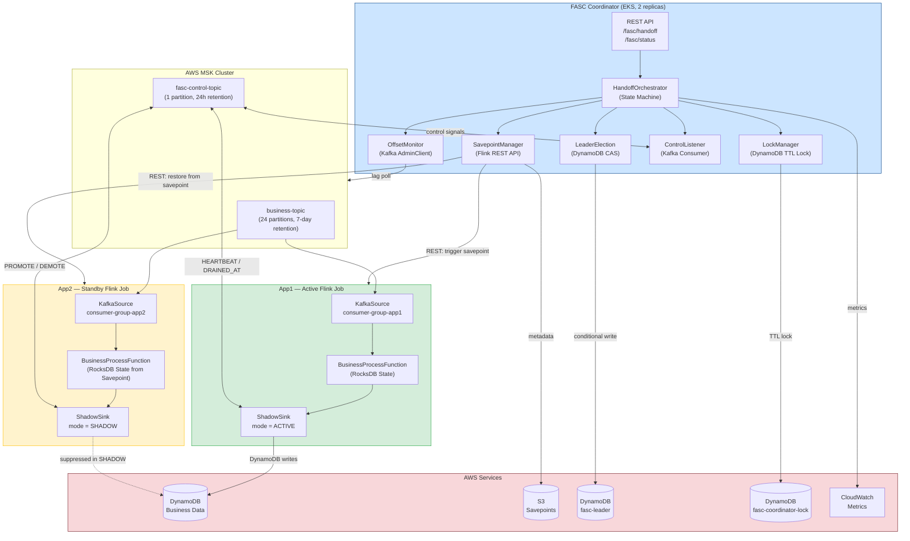
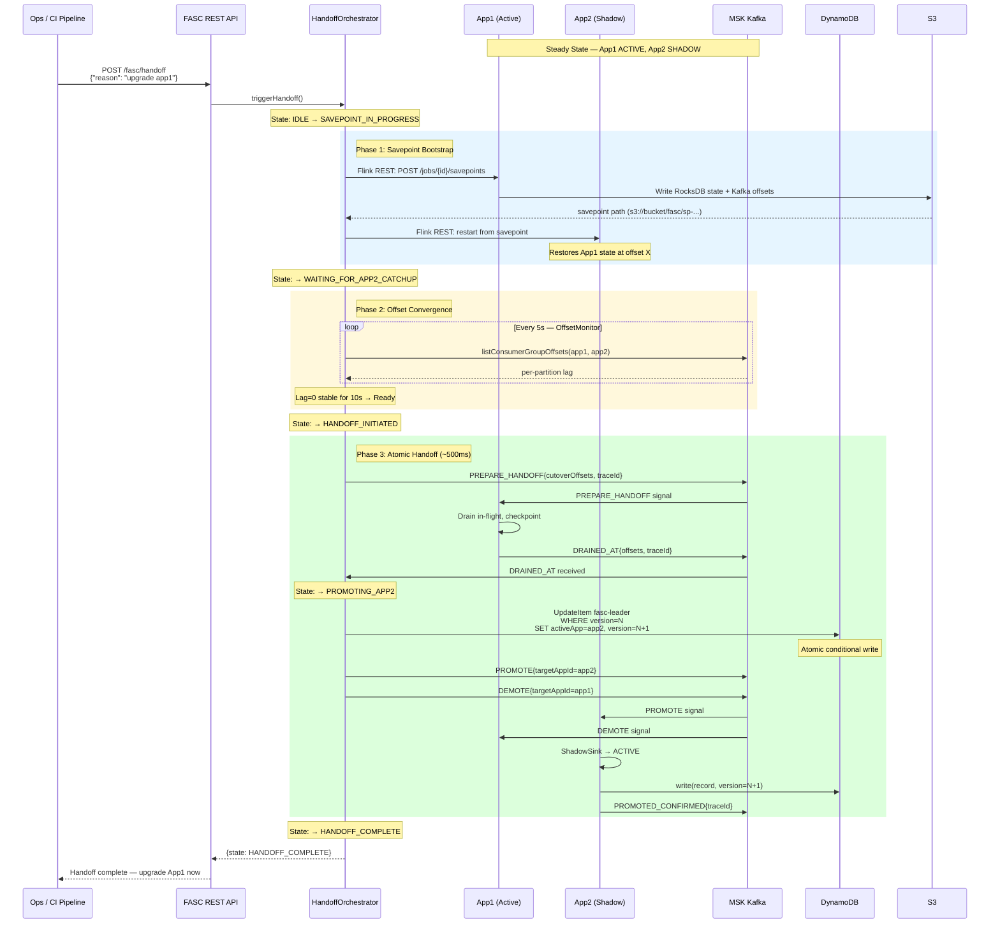
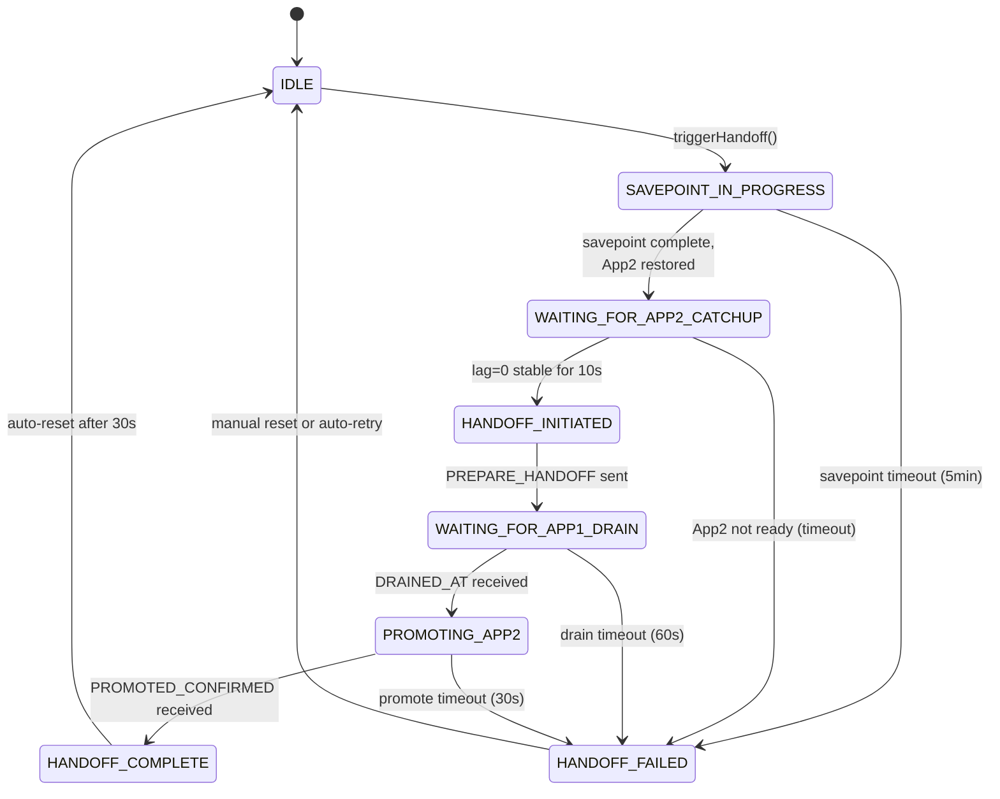
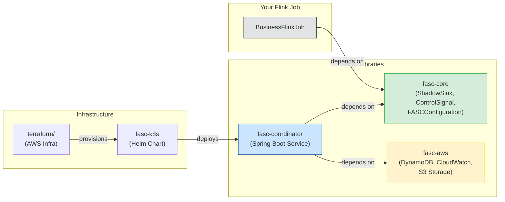
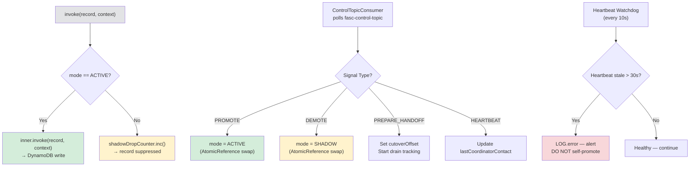
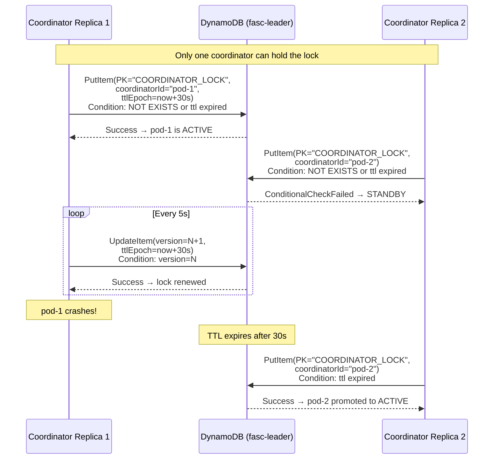
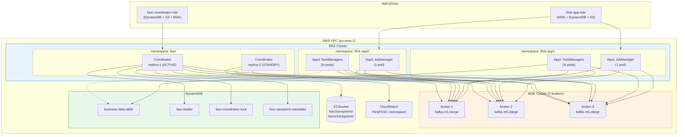
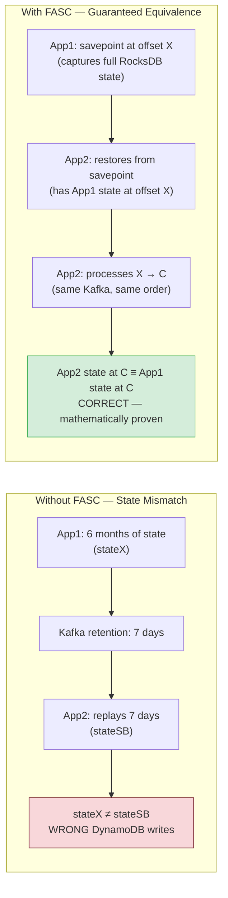
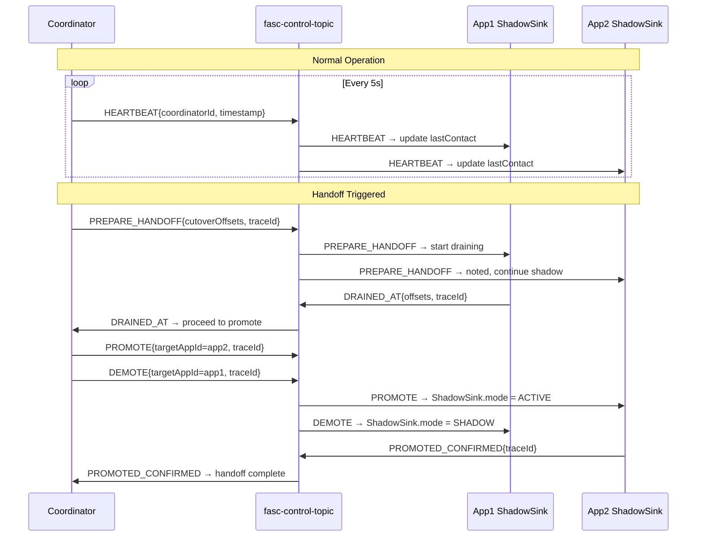

# FASC Architecture Diagrams

This document contains all architecture and data-flow diagrams for the
Flink Active-Standby Coordinator (FASC) project. All diagrams use Mermaid
and render natively on GitHub.

---

## 1. High-Level System Architecture

---

## 2. End-to-End Handoff Sequence

---

## 3. Handoff State Machine

---

## 4. Module Dependency Graph

---

## 5. ShadowSink Internal Flow

---

## 6. DynamoDB Leader Election — Split-Brain Prevention

---

## 7. AWS Infrastructure Layout

---

## 8. Kafka Offset Convergence (Why Savepoint Bootstrap Matters)

---

## 9. Control Signal Protocol

